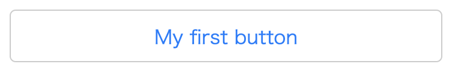
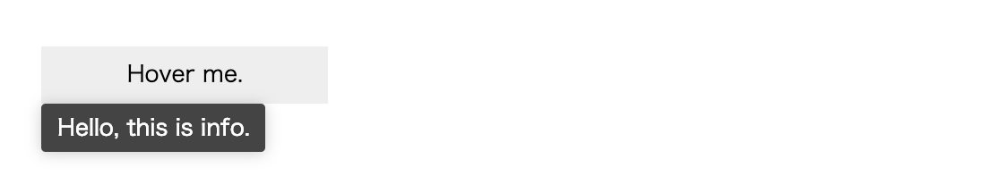
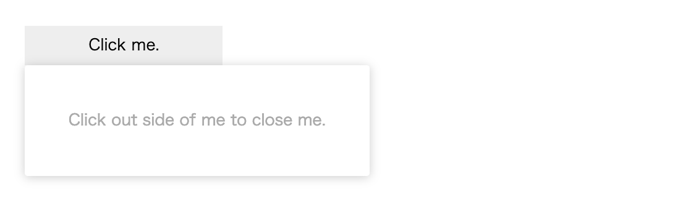
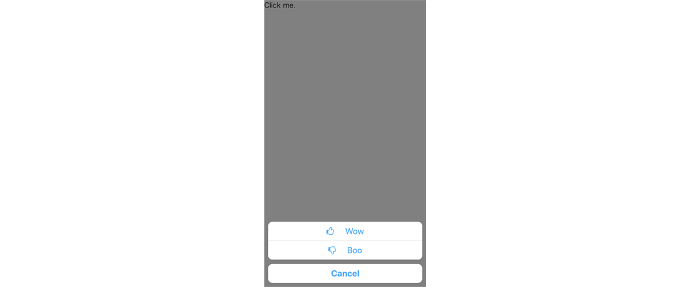

# Quick tools for Craft-UIKit 

Widgets for your first Craft-UIKit application.

## Requirement

QuickTools reuiqres font-awesome (^4.7.0).

## PlainButton



```html 
<html>
<head>
    <meta charset="utf-8">
    <title>PlainButton sample</title>
    <meta name="viewport" content="width=device-width, height=device-height, initial-scale=1.0, viewport-fit=cover"/>
    <script src="https://unpkg.com/@craftkit/craft-uikit/dist/craft-uikit.min.js"></script>
    <script src="https://unpkg.com/@craftkit/craft-widget-quicktools/dist/craft-widget-quicktools.min.js"></script>
    <script>
        window.onload = function(){
            Craft.Core.Bootstrap.boot({
                didBootApplication : function(options){
                    Craft.Core.Defaults.ALLOW_COMPONENT_SHORTCUT = true;
                    const btn = new Craft.Widget.QuickTools.PlainButton({
                        label   : "My first button",
                        handler : () => { alert("Wow"); }
                    });
                    btn.loadView();
                    document.getElementById('CraftRoot').appendChild(btn.view);
                }
            });
        };
    </script>
</head>
<body id="CraftRoot">
</body>
</html>

``` 

## IconButton


```html 
<html>
<head>
    <meta charset="utf-8">
    <!-- bug or spec: in Chrome, you have to load the same stylesheet in the global scope. Safari works fine. -->
    <link href="https://cdnjs.cloudflare.com/ajax/libs/font-awesome/4.7.0/css/font-awesome.min.css" rel="stylesheet">
    <title>IconButton sample</title>
    <meta name="viewport" content="width=device-width, height=device-height, initial-scale=1.0, viewport-fit=cover"/>
    <script src="https://unpkg.com/@craftkit/craft-uikit/dist/craft-uikit.min.js"></script>
    <script src="https://unpkg.com/@craftkit/craft-widget-quicktools/dist/craft-widget-quicktools.min.js"></script>
    <script>
        window.onload = function(){
            Craft.Core.Bootstrap.boot({
                didBootApplication : function(options){
                    Craft.Core.Defaults.ALLOW_COMPONENT_SHORTCUT = true;
                    const btn = new Craft.Widget.QuickTools.IconButton({
                        iconSource : "https://cdnjs.cloudflare.com/ajax/libs/font-awesome/4.7.0/css/font-awesome.min.css",
                        icon       : "fa fa-thumbs-o-up",
                        handler    : () => { alert("Wow"); }
                    });
                    btn.loadView();
                    document.getElementById('CraftRoot').appendChild(btn.view);
                }
            });
        };
    </script>
</head>
<body id="CraftRoot">
</body>
</html>
``` 

## TipsPanel



```html 
<html>
<head>
    <title>Tips sample</title>
    <meta name="viewport" content="width=device-width, height=device-height, initial-scale=1.0, viewport-fit=cover"/>
    <style>html,body { width: 100%; height: 100%; box-sizing:border-box; margin:0; padding:0; }</style>
    <script src="https://unpkg.com/@craftkit/craft-uikit/dist/craft-uikit.min.js"></script>
    <script src="https://unpkg.com/@craftkit/craft-widget-quicktools/dist/craft-widget-quicktools.min.js"></script>
    <script>
        window.onload = function(){
            Craft.Core.Bootstrap.boot({
                didBootApplication : function(options){
                    Craft.Core.Defaults.ALLOW_COMPONENT_SHORTCUT = true;
                    const rootViewController = new Craft.UI.DefaultRootViewController();
                    Craft.Core.Context.setRootViewController(rootViewController);
                    rootViewController.appendView(new TipableElement());
                }
            });
        };
        class TipableElement extends Craft.Widget.QuickTools.TipsPanelable {
            constructor(options){
                super();
                this.tips = 'Hello, this is info.';
                let content = new TipableContent();
                content.loadView();
                this.content = content;
            }
            style(){
                return `
                    :host { display:inline-block; }
                `;
            }
        }
        class TipableContent extends Craft.UI.View {
            style(){
                return `
                    .root { 
                        box-sizing: border-box;
                        width:200px; height:40px; margin:44px; 
                        cursor:pointer; background-color:#eee; 
                        text-align:center; line-height:40px;
                    }
                `;
            }
            template(self){
                return `
                    <div class="root">Hover me.</div>
                `;
            }
        }
    </script>
</head>
<body id="CraftRoot">
</body>
</html>
``` 

## ActionPanel

requires `ContentTapped` event, implemented in DefaultRootViewController



```html 
<html>
<head>
    <meta charset="utf-8">
    <title>ActionPanel sample</title>
    <meta name="viewport" content="width=device-width, height=device-height, initial-scale=1.0, viewport-fit=cover"/>
    <style>html,body { width: 100%; height: 100%; box-sizing:border-box; margin:0; padding:0; }</style>
    <script src="https://unpkg.com/@craftkit/craft-uikit/dist/craft-uikit.min.js"></script>
    <script src="https://unpkg.com/@craftkit/craft-widget-quicktools/dist/craft-widget-quicktools.min.js"></script>
    <script>
        window.onload = function(){
            Craft.Core.Bootstrap.boot({
                didBootApplication : function(options){
                    Craft.Core.Defaults.ALLOW_COMPONENT_SHORTCUT = true;
                    const rootViewController = new Craft.UI.DefaultRootViewController();
                    Craft.Core.Context.setRootViewController(rootViewController);
                    rootViewController.appendView(new PanelableElement());
                }
            });
        };
        class PanelableElement extends Craft.UI.View {
            constructor(options){
                super();
            }
            showPanel(target){
                this.actionPanel = new Craft.Widget.QuickTools.ActionPanel({
                    base : this
                });
                this.actionPanel.loadView();
                this.actionPanel.setContent(new InfoPanel());
                this.actionPanel.showPanel({
                    target     : target,
                    top_margin : -44 // see docs
                });
            }
            style(){
                return `
                    .root { 
                        box-sizing: border-box;
                        width:200px; height:40px; margin:44px; 
                        cursor:pointer; background-color:#eee; 
                        text-align:center; line-height:40px;
                    }
                `;
            }
            template(self){
                return `
                    <div class="root" onclick="${self}.showPanel(this);">Click me.</span>
                `;
            }
        }
        class InfoPanel extends Craft.UI.View {
            template(self){
                return `
                    <div style="padding:44px;">Click out side of me to close me.</div>
                `;
            }
        }
    </script>
</head>
<body id="CraftRoot">
</body>
</html>

``` 

## ActionSheet



```html 
<html>
<head>
    <title>ActionSheet sample</title>
    <meta name="viewport" content="width=device-width, height=device-height, initial-scale=1.0, viewport-fit=cover"/>
    <link href="https://cdnjs.cloudflare.com/ajax/libs/font-awesome/4.7.0/css/font-awesome.min.css" rel="stylesheet">
    <style>html,body { width: 100%; height: 100%; box-sizing:border-box; margin:0; padding:0; }</style>
    <script src="https://unpkg.com/@craftkit/craft-uikit/dist/craft-uikit.min.js"></script>
    <script src="https://unpkg.com/@craftkit/craft-widget-quicktools/dist/craft-widget-quicktools.min.js"></script>
    <script>
        window.onload = function(){
            Craft.Core.Bootstrap.boot({
                didBootApplication : function(options){
                    Craft.Core.Defaults.ALLOW_COMPONENT_SHORTCUT = true;
                    const rootViewController = new Craft.UI.DefaultRootViewController();
                    Craft.Core.Context.setRootViewController(rootViewController);
                    rootViewController.appendView(new SheetableElement());
                }
            });
        };
        class SheetableElement extends Craft.UI.View {
            openActionSheet(){
                const actionSheet = new Craft.Widget.QuickTools.ActionSheet({ 
                    iconSource : "https://cdnjs.cloudflare.com/ajax/libs/font-awesome/4.7.0/css/font-awesome.min.css",
                    actions:[
                        {
                            icon    : "fa fa-thumbs-o-up",
                            title   : "Wow",
                            handler : () => { alert("Wow"); }
                        },
                        {
                            icon    : "fa fa-thumbs-o-down",
                            title   : "Boo",
                            handler : () => { alert("Boo"); }
                        }
                    ]
                });
                
                const modalViewController = new Craft.UI.ModalViewController();
                modalViewController.loadView();
                modalViewController.setContent(actionSheet);
                Craft.Core.Context.getRootViewController().appendView(modalViewController);
                
                actionSheet.closeHandler = () => { modalViewController.unloadView(); };
                
                modalViewController.showContent();
            }
            style(){
                return `
                    .root { margin:44px; cursor:pointer; }
                `;
            }
            template(self){
                return `
                    <div class="root" onclick="${self}.openActionSheet();">Click me.</div>
                `;
            }
        }
    </script>
</head>
<body id="CraftRoot">
</body>
</html>

``` 

## License

MIT

